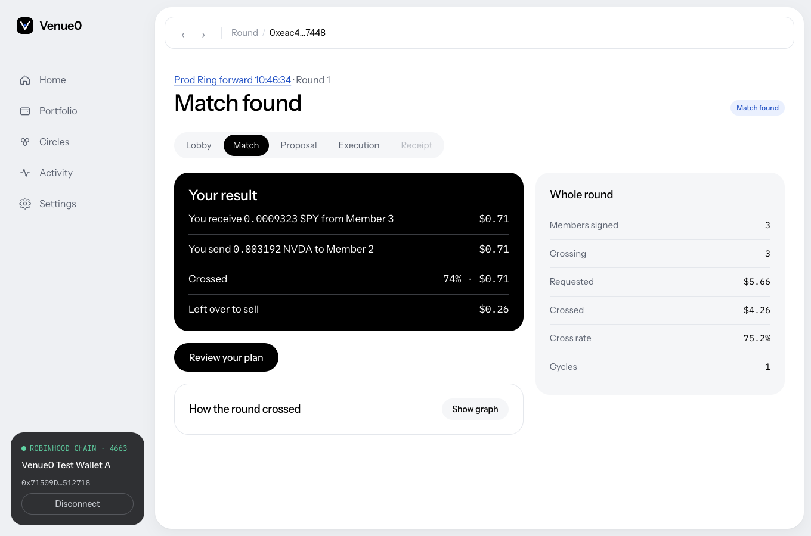
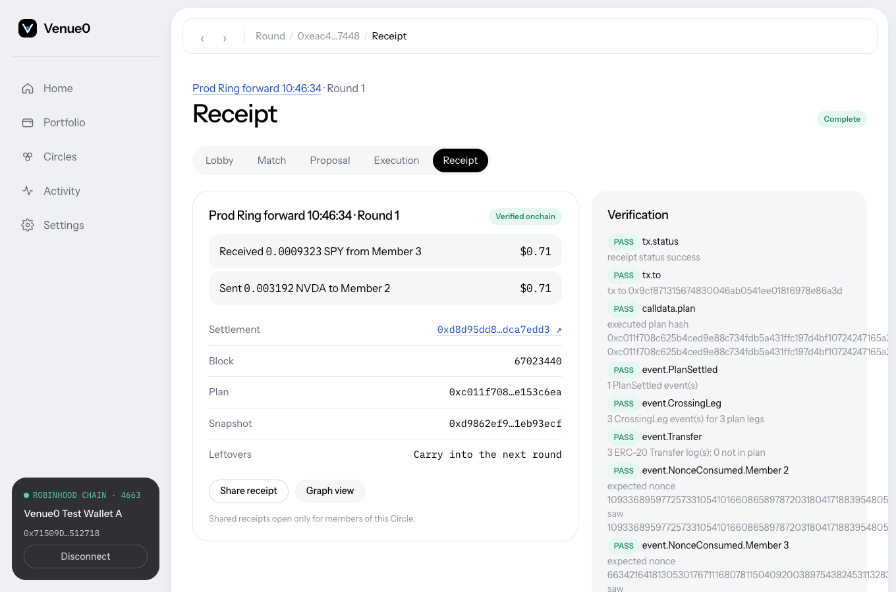
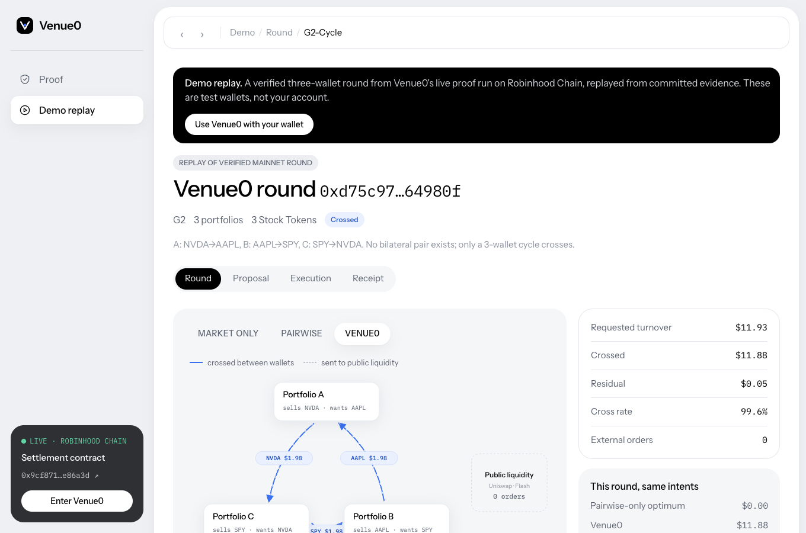

# VENUE0

**The market before the market.**

Portfolio agents cross complementary Stock Token rebalances with each other before sending only the residual to public liquidity.

| | |
|---|---|
| Public app | https://venue0.timjosh507.workers.dev |
| Live proof | https://venue0.timjosh507.workers.dev/proof |
| Demo replay | https://venue0.timjosh507.workers.dev/demo |

Venue0 runs on Robinhood Chain mainnet (chain 4663). Settlement contract: [`0x9cf871315674830046ab0541ee018f6978e86a3d`](https://robinhoodchain.blockscout.com/address/0x9cf871315674830046ab0541ee018f6978e86a3d). Every deployment fact is in [LIVE_DEPLOYMENTS.md](docs/LIVE_DEPLOYMENTS.md).

**Strongest live result.** Three operator-controlled test accounts, each signed in through Dynamic on the public app, set targets that no two of them could satisfy with each other (A sells NVDA for SPY, B sells AAPL for NVDA, C sells SPY for AAPL). Venue0 found the three-way cycle and settled it in one transaction. A different RPC provider than the one that executed it then verified the settlement from chain data: [`0xd8d95dd8…edd3`](https://robinhoodchain.blockscout.com/tx/0xd8d95dd809ece9ca6dc4b2fcf343332f62f50005677ef9def433d06edca7edd3), 14/14 checks, execution through Alchemy, verification through Chainstack.



## 1. Product

A user connects a wallet, sees their Stock Token portfolio, says where they want it to be, and joins a Circle. Each round, Venue0 looks across every member's signed rebalance and finds the parts that cancel out, including rings of three or more wallets that no pairwise venue would see. Those parts settle wallet to wallet in one atomic transaction. Whatever did not cross is the user's residual: carry it into the next round, trade it on Uniswap from their own wallet, or drop it. Every settlement is re-verified from chain data and ends in a receipt.

```
connect wallet → see portfolio → set target → join a Circle → sign intent
→ Venue0 matches complementary changes → approve the exact plan → atomic settlement
→ residual: carry forward / Uniswap / drop → independent verification → receipt
```

Venue0 is a portfolio-intent matching network. It is not an AMM, a broker, a settlement protocol, a copy-trading app or a trading bot. It does not custody tokens, set prices or decide what anyone should hold.

Product walkthrough: [PRODUCT.md](docs/PRODUCT.md).

## 2. Why it exists

When one wallet trims NVDA while another adds NVDA the same afternoon, both pay spread, fees and price impact against a pool, and neither sees the other. Offsetting rebalances often form rings (A wants B's asset, B wants C's, C wants A's) that no pair can match. Venue0 looks at portfolio goals before those trades exist and decides which portfolio changes should become direct trades at all. The mechanism and how it differs from market-only and bilateral matching: [THESIS.md](docs/THESIS.md).

## 3. How it works

| Step | What happens | Where |
|---|---|---|
| Target | The user sets weights, or describes them in words; code resolves every ticker against the live Robinhood registry and computes amounts from live balances and Chainlink prices | `packages/agent`, `packages/portfolio`, `packages/assets` |
| Intent | The user signs an EIP-712 intent: per-asset sell and buy limits at the round's price snapshot | `packages/settlement` |
| Match | A deterministic min-cost circulation solver maximizes crossed value across all intents, cycles of any length included | `packages/matcher` |
| Settle | Each participant approves the exact plan; `Venue0Settlement` moves every leg in one transaction | `contracts/src/Venue0Settlement.sol` |
| Residual | An economic engine compares all-in route costs (Uniswap, Flash) against the user's cost cap, or carries the residual forward | `packages/residual`, `packages/uniswap`, `packages/flash` |
| Verify | An independent verifier re-reads receipt, calldata, events and balances through its own RPC | `packages/verifier` |

Full design: [ARCHITECTURE.md](docs/ARCHITECTURE.md).

## 4. Live product

The public app is a working multi-user product: Dynamic sign-in (email with an embedded wallet, or an external wallet), live portfolio, saved targets, Circles with invites, round lobby, matching, plan approval, settlement from the user's own wallet, residual decisions, per-user receipts and activity. State is in Postgres (Supabase via Cloudflare Hyperdrive); the chain stays authoritative for balances and settlements.

Tested in production with three operator-controlled test accounts in separate browser profiles: three deployed-app rounds settled on mainnet, 13/13 concurrent-mutation checks and 15/15 auth and authorization checks passed. These are test accounts, not users.



## 5. Live proof

| Case | Result | Transaction |
|---|---|---|
| Two-wallet Stock Token swap | settled, verified | [0xd125…4a94](https://robinhoodchain.blockscout.com/tx/0xd125f8668883ae888a6f0507a09d665e49f77a202b1dc2dbf7e9936fc2764a94) |
| Three-wallet cycle (no pair could match) | $11.88 of $11.93 crossed, verified | [0xfdd1…3035](https://robinhoodchain.blockscout.com/tx/0xfdd14b8e7c4c4a2aedd567a51a15492159c0d0e67ae7ef94028f7c7aff863035) |
| Partial overlap with exact residual | settled, verified | [0x9d4d…aced](https://robinhoodchain.blockscout.com/tx/0x9d4d14d2eee13e542cbbf58e8feab98755035f9280585878f2213984e23faced) |
| Zero overlap | NO_CROSS, no transaction by design | [evidence](evidence/live/L4-no-cross/) |
| Residual through Uniswap | exact quoted output received | [0xaec4…84db](https://robinhoodchain.blockscout.com/tx/0xaec4488e2ba8d2dcd14fdbaec15d6fde31398a980175fd1fe5bcf8f56d8a84db) |
| Residual through Definitive Flash (limit) | filled; fee made a $1.20 order uneconomic | [0xa30e…5fc6](https://robinhoodchain.blockscout.com/tx/0xa30e95a18cc90b99f141f611118dce5bcd7251111038d5bab9d79947f9e55fc6) |
| Dynamic server-wallet agent in a round | signed intent, approval and allowance through Dynamic MPC | [0x0f85…1873](https://robinhoodchain.blockscout.com/tx/0x0f851b81082f93f863ddceeae3f4aff47ad6eac52f04482985eb75e187a91873) |
| Deployed app, independent verification (P3) | 14/14, independent providers | [0xd8d9…edd3](https://robinhoodchain.blockscout.com/tx/0xd8d95dd809ece9ca6dc4b2fcf343332f62f50005677ef9def433d06edca7edd3) |

Every row, with artifacts and limitations: [EVIDENCE.md](docs/EVIDENCE.md). Gate history: [GATES.md](docs/GATES.md).



## 6. Results

400 frozen synthetic scenarios (not users), four arms on identical intents and prices:

- Venue0 crossed **10.2%** of requested notional internally (median scenario 13.5%).
- **32% fewer** external orders than market-only.
- **26.3% more** crossed notional than an optimal bilateral-only matcher on the same inputs, which is **+2.1 points** of requested notional in absolute terms.
- **400/400** agreement with an independent reference solver.

The gain concentrates in larger, circle-style rounds (THEME_CIRCLE: 43.3% vs 34.4% bilateral). It is small in 2-3 participant rounds and near zero below about 10% complementarity. Negative results and methodology: [CAMPAIGN_RESULTS.md](docs/CAMPAIGN_RESULTS.md). No cost savings for real users are claimed.

## 7. Architecture

Offchain: target resolution, matching, residual decisions, verification and product state. Onchain: one small settlement contract that executes a fully approved plan atomically and holds nothing. [ARCHITECTURE.md](docs/ARCHITECTURE.md) has the component diagram, the round lifecycle and trust boundaries. Decisions and alternatives: [DECISIONS.md](docs/DECISIONS.md).

## 8. Integrations

| Provider | Role | Status |
|---|---|---|
| Robinhood Chain | canonical Stock Tokens and the settlement chain | live |
| Dynamic | user sign-in and wallets in the app; server-wallet agent in a live round | live (Sandbox); delegated access not implemented |
| Uniswap Trading API | public residual liquidity | live swap |
| Definitive Flash | limit and TWAP residual routes | live limit fill |

Details, code paths and evidence: [SPONSOR_INTEGRATIONS.md](docs/SPONSOR_INTEGRATIONS.md). Friction found while building: [SPONSOR_FINDINGS.md](docs/SPONSOR_FINDINGS.md) and [UNISWAP_FEEDBACK.md](docs/UNISWAP_FEEDBACK.md).

## 9. Security

No protocol custody, EIP-712 approvals over the exact plan, unordered nonces, exact allowances, all-or-nothing settlement, server-side Dynamic JWT verification bound to the verified wallet, settlement reports checked against the plan's calldata, and verification through a separate RPC provider. `Venue0Settlement` has not had an external audit. [SECURITY.md](docs/SECURITY.md).

## 10. Reproduction

Tests, the matcher, the reference solver, the campaign and the web app all run locally without funds or keys: `pnpm install && pnpm test && pnpm test:contracts && pnpm campaign`. [REPRODUCTION.md](docs/REPRODUCTION.md) separates what is local from what needs funded wallets and API keys.

Current checks: 95 TypeScript tests, 32 Foundry tests, typecheck, lint and `next build` pass.

## 11. Limitations

Operator-controlled test accounts, not adoption. Synthetic campaign. Small live sizes ($1-$12 per round). Dynamic Sandbox. Unaudited contract. Full list: [PRODUCT_LIMITATIONS.md](docs/PRODUCT_LIMITATIONS.md). Every public claim with its evidence and limitation: [CLAIM_LEDGER.md](docs/CLAIM_LEDGER.md).

## 12. Repository map

| Path | Contents |
|---|---|
| `apps/web` | Next.js app: public site, product (`/app`), `/proof`, `/demo`, API routes, Postgres store |
| `packages/assets` | Robinhood registry client, canonical Stock Token identity, onchain checks, Chainlink valuation |
| `packages/portfolio` | holdings, targets, rebalance math, valuation snapshots, intent types |
| `packages/agent` | natural-language goal interpretation (untrusted) and the deterministic resolver that owns every number |
| `packages/matcher` | production min-cost circulation matcher |
| `packages/reference-matcher` | independent solvers (exact rational simplex, HiGHS LP, pairwise baseline) used to check the matcher |
| `packages/settlement` | EIP-712 types, plan building, preflight, generated contract bindings |
| `packages/verifier` | independent settlement verifier (receipt, calldata, events, state, balances) |
| `packages/residual` | economic residual engine and session model |
| `packages/uniswap`, `packages/flash` | residual execution clients |
| `packages/dynamic` | Dynamic server-wallet agent |
| `packages/circles` | Circle rules and the round state machine |
| `packages/shared` | chain config, logging, fixed-point helpers |
| `contracts` | `Venue0Settlement.sol` and Foundry tests |
| `campaign` | frozen scenario generator, runner and results |
| `scripts` | live proof scripts, deploy, migrations, end-to-end harness |
| `evidence` | machine-readable artifacts from every live run |
| `docs` | the documents linked above |

Machine-readable summary of the facts on this page: [`submission-facts.json`](submission-facts.json).

## 13. Runtime submission context

Built for the Runtime hackathon (September 2026). The original product specification is kept as [docs/PRD_2026-09-17.md](docs/PRD_2026-09-17.md); where this repository and the PRD differ, the repository reflects what was built and verified.

Licensed under the [MIT License](LICENSE).

Stock Tokens are tokenised debt securities issued by Robinhood Assets (Jersey) Limited. They give economic exposure to the underlying securities and no legal or beneficial rights in them, are not offered to U.S. persons and are restricted in other jurisdictions. Venue0 is software, not investment advice.
