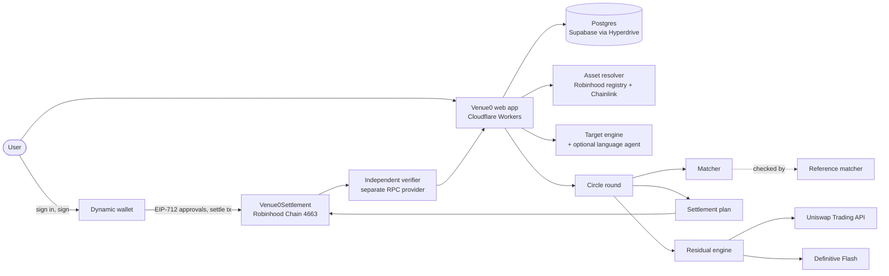

# Architecture

[README](../README.md) · [Thesis](THESIS.md) · [Security](SECURITY.md) · [Decisions](DECISIONS.md) · [Live deployments](LIVE_DEPLOYMENTS.md)

## Overview

Everything that decides happens offchain and is deterministic: asset resolution, target math, matching, residual decisions, verification. Onchain there is one contract that executes a plan every participant signed, and holds nothing. The web app stores product state in Postgres; balances, prices and settlement outcomes are always read from Robinhood Chain.



## Components

| Component | Responsibility | Code |
|---|---|---|
| User and wallet | Signs in with Dynamic (email with an embedded wallet, or an external wallet); signs every intent, approval and transaction | `apps/web/components/wallet/` |
| Asset resolver | Resolves Stock Tokens only from the live Robinhood registry; checks bytecode, `symbol()`, `decimals()`, `uid()` onchain; values holdings with Chainlink feeds cross-checked against Robinhood's REST price | `packages/assets` |
| Portfolio and target engine | Live holdings, target weights, rebalance deltas, valuation snapshots, per-asset intent limits | `packages/portfolio`, `apps/web/lib/server/targets.ts` |
| Language agent (optional) | Reads a sentence into structured operations; never supplies addresses, prices or amounts (see below) | `packages/agent` |
| Circle | Membership, asset universe, round duration, minimum participants, leftover behavior, single-use invites | `apps/web/lib/server/circles.ts`, `packages/circles` |
| Round | State machine from OPEN to COMPLETE (PRD §12 transition table), advanced by compare-and-set on the stored state | `apps/web/lib/server/rounds.ts` |
| Matcher | Min-cost circulation by min-mean cycle canceling on a $0.01 lot grid; deterministic; integer amounts | `packages/matcher` |
| Reference matcher | Independent exact rational simplex (up to 6 participants) and HiGHS LP (larger rounds), plus the pairwise-optimum baseline | `packages/reference-matcher` |
| Settlement plan | Canonical plan (participants ascending, legs ascending by token, from, to), EIP-712 typed data, preflight of balances, allowances, pause and blocklist state | `packages/settlement` |
| Venue0Settlement | Verifies every participant's approval, consumes nonces, moves every leg with `transferFrom`, emits per-leg events | `contracts/src/Venue0Settlement.sol` |
| Residual engine | Picks EXECUTE_NOW, LIMIT, TWAP, WAIT, AGGREGATE or CANCEL from measured all-in route costs, the user's cost cap and the market session | `packages/residual` |
| Uniswap / Flash clients | Quote, approve, sign and execute residuals; read balances back after execution | `packages/uniswap`, `packages/flash` |
| Independent verifier | Re-derives the outcome from the receipt, calldata, events, contract state and balances at the receipt block, through its own RPC | `packages/verifier` |
| Postgres | Users, targets, circles, memberships, invites, rounds, intents, approvals, residual decisions, activity | `apps/web/lib/server/db/` |

## Round lifecycle

```
portfolio → target → intent → round → solve → proposal → approvals → settlement → residual → verification → receipt
```

1. **Portfolio.** Balances are read live from the chain (one multicall) and valued with Chainlink feeds read at one pinned block.
2. **Target.** The user saves weights. The resolver checks them against live holdings before saving.
3. **Round.** Entering a Circle's lobby opens a round if none is running and captures a price snapshot of the Circle's assets (each feed cross-checked against Robinhood's REST price within 100 bps).
4. **Intent.** The server builds the user's intent from their saved target, live balances and the snapshot, restricted to the Circle's assets. The user signs it (EIP-712); the server verifies the signature before storing it.
5. **Solve.** When the window closes or every member has signed, the round freezes and the matcher runs on the frozen intents and snapshot. Outcomes: PROPOSED, NO_CROSS, INSUFFICIENT_PARTICIPANTS, PLAN_STALE or EXPIRED.
6. **Proposal.** Each member sees only their own legs and residual; other members appear as "Member 2", "Member 3".
7. **Approvals.** Each participant signs the exact plan and grants an exact allowance for their own outflows. The last approval moves the round to READY_TO_SETTLE.
8. **Settlement.** Any participant sends `settle()` from their own wallet. The server accepts the reported hash only if it is a call on chain 4663 to the settlement contract whose calldata hashes to this round's plan.
9. **Residual.** Each user decides what happens to their residual: carry it into the next round of the Circle, trade it on Uniswap from their wallet (approval, Permit2 signature, swap, balance readback), or drop it. The engine's recommendation and reasons are shown.
10. **Verification.** Receipt check, then the verifier, as short steps driven by the page's polling. The result sets COMPLETE or VERIFICATION_FAILED.
11. **Receipt.** Per-user legs, transaction, plan and snapshot hashes, verifier checks and the RPC providers used.

## Trust boundaries

| Boundary | Trusted for | Not trusted for |
|---|---|---|
| User's wallet | Every signature and transaction | nothing else: Venue0 never holds keys |
| Language model | Reading words into operations | tickers, addresses, prices, amounts, fills, onchain truth |
| Venue0 server | Building intents and plans, running the matcher, storing state | the outcome: a participant can check the plan they sign, and the verifier checks the result from chain data |
| Venue0Settlement | Enforcing approvals, nonces, validity and atomicity | pricing (it does not read oracles) and custody (it holds nothing) |
| Execution RPC (Alchemy) | Reads and submitting transactions | verifying its own results |
| Verification RPC (Chainstack) | Independent reads of the settlement | nothing written |
| Robinhood registry and Chainlink | Asset identity and valuation | each is cross-checked: registry records against onchain state, feeds against REST prices |
| Uniswap, Flash | Executing a residual the user chose | nothing is marked done until balances are read back |
| Dynamic | Authenticating the user and proving wallet ownership (JWT verified server-side against the environment JWKS) | anything beyond the session |

## Language agent boundary

The model reads a sentence such as "reduce NVDA to 20% and put the rest into SPY" into a structured goal: operations, tickers as written, constraints and open questions. It produces nothing else. Code then:

- resolves each ticker against the canonical registry and rejects lookalikes,
- reads balances and prices itself,
- computes every target value and every raw amount with integer arithmetic,
- checks weights, conflicts and pending corporate actions,
- builds the intent the user signs.

The model does not invent addresses, perform settlement arithmetic, create fills or decide what happened onchain. If no model is configured (the production default), the "Set weights" mode is the full product and runs the same checks. Supported providers: Groq (`openai/gpt-oss-120b`, strict JSON schema) or Anthropic (`claude-opus-5`, structured outputs), both validated with the same schema.

## Deployment

Cloudflare Workers via OpenNext, one Postgres client per request through Cloudflare Hyperdrive to Supabase's direct connection, migrations as a deploy step. Configuration: [PRODUCTION_CONFIG.md](PRODUCTION_CONFIG.md).
